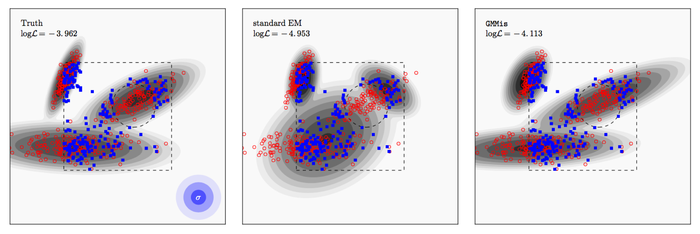

# pyGMMis

Got gaps in your data? Sample observability varies? We can help.

**pyGMMis** is mixtures-of-Gaussians density estimation method that accounts for arbitrary incompleteness in the process that creates the samples as long as

* you know the incompleteness over the entire feature space,
* the incompleteness does not depend on the sample density (missing at random).

Under the hood, **pyGMMis** uses the Expectation-Maximization procedure and generates its best guess of the unobserved samples on the fly.

It can also incorporate an uniform "background" distribution as well as independent multivariate normal measurement errors for each of the observed samples, and then recovers an estimate of the error-free distribution from which both observed and unobserved samples are drawn.



In the example above, the true distribution is shown as contours in the left panel. We then draw 400 samples from it (red), add Gaussian noise to them (1,2,3 sigma contours shown in blue), and select only samples within the box but outside of the circle (blue).

The code is written in pure python (developed and tested in 2.7), parallelized with `multiprocessing`, can automatically segment the data into localized neighborhoods, and is capable of performing density estimation with millions of samples and thousands of model components on machines with sufficient memory.

More details are in the paper of [Melchior & Goulding (2016)](http://arxiv.org/abs/1611.05806). Please cite the paper if you make use of this code.

## Prerequisites

* numpy
* scipy
* multiprocessing
* parmap

## How to run the code

1. Create a GMM object with the desired component number K and data dimensionality D:
   ```gmm = pygmmis.GMM(K=K, D=D) ```

2. To avoid excessive copying of the data between separate `multiprocessing` processes, create a shared structure:
   ```data = pygmmis.createShared(data)```

3. Define a callback for the completeness function, which is called with e.g. `data` with shape (N,D) and returns an boolean array of size N whether the sample was observed or not. Two examples:

   ```python
   def cutAtSix(coords):
   	"""Selects all samples whose first coordinate is < 6"""
       return (coords[:,0] < 6)

   def selSlope(coords, rng=np.random):
       """Selects probabilistically according to first coordinate x:
       Omega = 1    for x < 0
             = 1-x  for x = 0 .. 1
             = 0    for x > 1
       """
       return rng.rand(len(coords)) > coords[:,0]
   ```

4. If there is noise (aka positional uncertainties) on the samples, you need to provide two things:

   * The covariance of each data sample, or one for all. If it's the former, make a shared structure using `pygmmis.createShared`.
   * Provide a callback function that returns an estimate of the covariance at arbitrary locations.

   ```python
   def covar_tree_cb(coords, tree, covar):
       """Return the covariance of the nearest neighbor of coords in data.""""
       dist, ind = tree.query(coords, k=1)
       return covar[ind.flatten()]

   from functools import partial
   from sklearn.neighbors import KDTree
   tree = KDTree(data, leaf_size=100)
   covar = pygmmis.createShared(covar)
   covar_cb = partial(covar_tree_cb, tree=tree, covar=covar)
   ```

5. If there is a uniform background that is unrelated to the features you want to fit, you need to define it. Caveat: Because a uniform distribution is normalizable only if its support is finite, you need to decide on the footprint over which the background model is present, e.g.:

   ```python
    footprint = data.min(axis=0), data.max(axis=0)
    bg = pygmmis.Background(footprint)
    bg.amp = 0.3
    bg.amp_max = 0.5
    bg.adjust_amp = True
   ```

6. Provide an initialization callback. This tells the GMM what initial parameters is should assume. We have provided a few plausible ones for your perusal:

   * `pygmmis.initFromDataMinMax()`
   * `pygmmis.initFromDataAtRandom()`
   * `pygmmis.initFromSimpleGMM()`
   * `pygmmis.initFromKMeans()`

   For difficult situations or if you are not happy with the convergence, you may want to define your own. The signature is: 

   ```def init_callback(gmm, data=None, covar=None, rng=np.random)```

7. Run the fitter:

   ```python
   w = 0.1    # minimum covariance regularization, same units as data
   cutoff = 5 # segment the data set into neighborhood within 5 sigma around components
   tol = 1e-3 # tolerance on logL to terminate EM
   pygmmis.VERBOSITY = 1      # 0,1,2
   pygmmis.OVERSAMPLING = 10  # number of imputation samples per data sample

   # define RNG for deterministic behavior
   from numpy.random import RandomState
   seed = 42
   rng = RandomState(seed)

   # run EM
   logL, U = pygmmis.fit(gmm, data, init_callback=pygmmis.initFromDataMinMax,\
                         sel_callback=cb, covar_callback=covar_cb, w=w, cutoff=cutoff,\
                         background=bg, tol=tol, rng=rng)
   ```

   This runs the EM procedure until tolerance is reached and returns the final mean log-likelihood of all samples, and the neighborhood of each component (indices of data samples that are within cutoff of a GMM component).

8. Evaluate the model:

   ```python
   # log of p(x)
   p = gmm(test_coords, as_log=False)
   N_s = 1000
   # draw samples from GMM
   samples = gmm.draw(N_s)

   # draw sample from the model with noise, background, and selection:
   # if you want to get the missing sample, set invert_sel=True.
   # N_orig is the estimated number of samples prior to selection
   obs_size = len(data)
   samples, covar_samples, N_orig = pygmmis.draw(gmm, obs_size, sel_callback=cb,\
                                                 invert_sel=False, orig_size=None,\
                                                 covar_callback=covar_cb,background=bg)
   ```


For a complete example, have a look at [the test script](tests/test.py). For requests and bug reports, please open an issue.